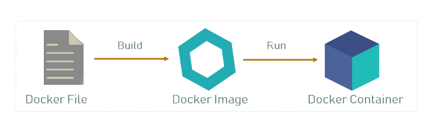

import { Callout } from 'nextra-theme-docs'
import Image from 'next/image'
import { Steps } from 'nextra-theme-docs'
import { Card, Cards } from 'nextra-theme-docs'
import Link from 'next/link'

# Docker

<Callout emoji="ℹ️" type="info">
Docker is considered an advanced setup, it is recommended that you understand how Docker works before deciding to use this method.
</Callout>



## Prerequisites

* Supported OS for Docker
* Docker Engine
* Docker Compose

## Installing Docker Engine

Docker has their own installation page for popular Linux-based distros, read them by visiting the link below:

<Cards>
  <Card
    icon={
      <svg
        xmlns="http://www.w3.org/2000/svg"
        fill="none"
        viewBox="0 0 24 24"
        strokeWidth={1.5}
        stroke="currentColor"
        className="h-6 w-6"
      >
        <path
          strokeLinecap="round"
          strokeLinejoin="round"
          d="M9.813 15.904L9 18.75l-.813-2.846a4.5 4.5 0 00-3.09-3.09L2.25 12l2.846-.813a4.5 4.5 0 003.09-3.09L9 5.25l.813 2.846a4.5 4.5 0 003.09 3.09L15.75 12l-2.846.813a4.5 4.5 0 00-3.09 3.09zM18.259 8.715L18 9.75l-.259-1.035a3.375 3.375 0 00-2.455-2.456L14.25 6l1.036-.259a3.375 3.375 0 002.455-2.456L18 2.25l.259 1.035a3.375 3.375 0 002.456 2.456L21.75 6l-1.035.259a3.375 3.375 0 00-2.456 2.456zM16.894 20.567L16.5 21.75l-.394-1.183a2.25 2.25 0 00-1.423-1.423L13.5 18.75l1.183-.394a2.25 2.25 0 001.423-1.423l.394-1.183.394 1.183a2.25 2.25 0 001.423 1.423l1.183.394-1.183.394a2.25 2.25 0 00-1.423 1.423z"
        />
      </svg>
    }
    title="Install Docker"
    href="https://docs.docker.com/engine/install/"
  />
</Cards>

If you're on a desktop environment, refer to the "Desktop" section of their documentation as Docker Desktop also comes with nice GUI that you manage your deployments with.

For VPS and servers, refer to the "Server" section as you will be needed to learn the CLI commands to run Modmail with Docker.

After the installation process has finished, you can try running the commands below in your terminal to see if **Docker** and **Docker Compose** has been installed successfully:

```docker
docker --version
docker compose version
```

<Callout emoji="ℹ️" type="info">
You may need to change your Docker Compose command to `docker-compose --version` depending on the version you have installed.
</Callout>

## Running the official image for Modmail

You can pull the latest official image from Modmail repository by using the following command:

```docker
docker pull ghcr.io/modmail-dev/modmail:master
```

This will take some time depending on the speed of your network. It will also update the already existing image if you have previously pulled the same image before.

After that, you can run the bot as a container with the following command:

```docker
docker run -d --name modmail \
--env-file /path/to/.env \
--restart always ghcr.io/modmail-dev/modmail:master
```

Make sure to change `/path/to/.env` to the location of the `.env` file containing all the variables that you want the bot to start with. Refer to the steps in the [parent Installation page](../#preparing-your-environmental-variables) to find where to obtain these.

After deploying, you can view the logs of your currently running Modmail container with the following command:

```docker
docker logs modmail
```

You can stop your running Modmail container with:

```
docker stop modmail
```

Stopping the container does not remove the container files, so you can start it back up with:

```
docker start modmail
```

If you want to stop and remove the container completely, you can do so with:

```
docker rm -f modmail
```

The `-f` will forcefully remove and delete the container even if it's currently running. You can omit the flag if the container is already stopped.

## Building the image locally

You can also build the image locally on your machine if the repository files are already in your machine. In your Modmail project folder, simply run the build command below:

```
docker build . -t myname/modmail:latest
```

The `.` in the command will use the `Dockerfile` in the Modmail repository as the build steps. The `-t` flag will specify the image tag so it's easier for us to differentiate between multiple images in our system. Verify if the image is successfully built with the following command:

```
docker images
```

You should be able to see the tag we just used in the list:


Now you can use the `docker run` command to run your bot using your locally-built image:

```docker
docker run -d --name modmail \
--env-file /path/to/.env \
--restart always myname/modmail:latest
```

## Updating on Docker

Auto-update is disabled when running Docker as Docker container state is not persistent across restarts. To update your bot, you will need to update the base image by running the `docker pull` command in the previous step: [Running the official image for Modmail](docker.md#running-the-official-image-for-modmail) if your image is based from the official repository. After that, you must recreate your container using the `docker rm` and `docker run` command again.

If your image is created locally, simply replace the `docker pull` command with `git pull` and rebuilding your image again.

To automate this process on Docker, you can look into running [Watchtower](https://containrrr.dev/watchtower/) which will auto-update your containers whenever a new image is pushed on the remote repository. Please refer to their documentation for guide and configuration.

